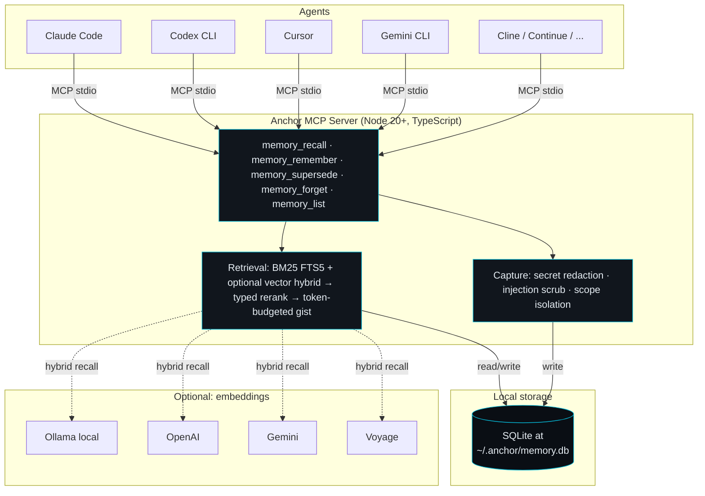

<div align="center">

<h1>Anchor</h1>

<p><strong>Cross-agent memory for AI coding agents. Local-first.</strong></p>

<p>Switch agents — Claude Code, Codex, Cursor, Cline, Gemini CLI — and your project context comes with you.</p>

<p>
  <a href="https://www.npmjs.com/package/@anchormem/anchor"></a>
  <a href="LICENSE"></a>
  <a href="https://modelcontextprotocol.io"></a>
  <a href="https://skills.sh"></a>
  <a href="CONTRIBUTING.md"></a>
</p>

</div>

---

## The problem

You build context with one agent — preferences, decisions, the mental model of a codebase — over hours. Then you switch tools. The next agent starts cold. You re-explain. It re-litigates settled choices. It asks questions you already answered.

This isn't a Claude problem or a Gemini problem. It's a **portability problem**: memory is locked inside each vendor's session.

## The fix

Anchor is a local-first MCP server and an open Agent Skill. Any modern AI coding agent can read from and write to a single, durable memory of your project. When the next agent starts, it calls `memory_recall` and gets a token-budgeted summary of what matters — not a transcript dump.

> [!NOTE]
> **Available now:** `npx @anchormem/anchor init` — three commands and you're set up.
> No accounts. No API keys. One SQLite file at `~/.anchor/memory.db`.

---

## How much smaller is the context?

Measured offline against pasting prior session transcripts (the realistic alternative when an agent has no memory):

<table>
<thead>
<tr>
<th align="left">Scenario</th>
<th align="right">Without Anchor</th>
<th align="right">With Anchor</th>
<th align="right">Reduction</th>
<th align="right">Relevant hits</th>
</tr>
</thead>
<tbody>
<tr>
<td>Adding rate limiting to <code>/auth/*</code> endpoints</td>
<td align="right">9,400 tokens</td>
<td align="right"><strong>224 tokens</strong></td>
<td align="right"><strong>97.6%</strong></td>
<td align="right">5 / 5</td>
</tr>
<tr>
<td>Migrating billing to Stripe Checkout</td>
<td align="right">7,800 tokens</td>
<td align="right"><strong>163 tokens</strong></td>
<td align="right"><strong>97.9%</strong></td>
<td align="right">3 / 3</td>
</tr>
</tbody>
</table>

Reproducible: `node tests/eval/run.mjs`. Both scenarios live in `tests/eval/fixtures.mjs` if you want to add your own.

---

## Quick start

```bash
# 1. Install and initialize (creates ~/.anchor/)
npx @anchormem/anchor init

# 2. Tell Claude Code about it
claude mcp add anchor -- anchor-server

# 3. Open the interactive console any time
anchor
```

That's it. Your next session can call `memory_recall` and `memory_remember` automatically.

> [!TIP]
> Verify everything is wired up: `claude mcp list` should show `anchor: ✓ Connected`, and `anchor doctor` reports the status of your data dir, scope detection, redaction, and agent config.

<details>
<summary><b>Other agents</b> (Codex, Cursor, Cline, Continue.dev, Windsurf, OpenCode, Zed, Gemini CLI)</summary>

### Codex CLI

```toml
# ~/.codex/config.toml
[mcp.anchor]
command = "anchor-server"
```

### Cursor

```json
// .cursor/mcp.json
{
  "mcpServers": {
    "anchor": { "command": "anchor-server" }
  }
}
```

### Cline · Continue.dev · Windsurf · OpenCode · Zed · Gemini CLI

Each accepts an MCP server entry. Use `command: anchor-server` and refer to the host's MCP documentation for the configuration file location. PRs welcome with tested snippets — see [CONTRIBUTING.md](CONTRIBUTING.md).

</details>

<details>
<summary><b>Auto-load memory at session start</b> (zero tool calls from the agent)</summary>

A `SessionStart` hook injects your project's prior context the moment a session begins. The agent never has to call any tool — Anchor figures out the project scope from `cwd`, retrieves a 1,500-token gist, and emits it in the format the host expects.

For Claude Code:

```jsonc
// ~/.claude/settings.json
{
  "hooks": {
    "SessionStart": [{ "command": "anchor hook claude-code session-start" }]
  }
}
```

For other agents, pipe the plain-text output into the agent's system-prompt flag:

```bash
echo '{"cwd":"'"$PWD"'"}' | anchor hook generic session-start
```

When the project scope has no memories, the hook emits nothing — Anchor never wastes the agent's context budget. Supported flavors: `claude-code`, `gemini`, `codex`, `opencode`, `hermes`, `generic`.

</details>

---

## How it works

Your agent calls two tools. Anchor stores everything in four typed records.

<table>
<thead>
<tr>
<th width="20%">Type</th>
<th>What it stores</th>
<th>Example</th>
</tr>
</thead>
<tbody>
<tr>
<td><kbd>fact</kbd></td>
<td>A durable preference or constraint.</td>
<td><em>"uses pnpm, not npm"</em></td>
</tr>
<tr>
<td><kbd>decision</kbd></td>
<td>A choice made, with rationale.</td>
<td><em>"use Postgres for the orders service — ACID + team familiarity"</em></td>
</tr>
<tr>
<td><kbd>episode</kbd></td>
<td>A 1–3 sentence task summary written by the agent itself.</td>
<td><em>"Added rate limiting via Redis token bucket; touched src/auth/*"</em></td>
</tr>
<tr>
<td><kbd>artifact</kbd></td>
<td>A pointer to a file, symbol, or URL.</td>
<td><code>src/auth/middleware.ts:42</code></td>
</tr>
</tbody>
</table>

When a fact goes stale, the agent uses `memory_supersede` instead of adding a contradicting one. Old episodes age out via salience decay; secrets get redacted at write time; provenance travels with every recalled item.

> [!IMPORTANT]
> **Anchor itself has no LLM.** Your agent already has a frontier model loaded with full conversation context — it writes its own episode summaries before calling `memory_remember`. Anchor stores, retrieves, ranks, redacts, and compresses. All deterministic.

### Architecture



The MCP server is the runtime. The Skill (`SKILL.md`) is the cross-agent contract that makes the runtime usable consistently across agents that speak the [Open Agent Skills](https://skills.sh) specification.

---

## Performance

Tested at scale on Windows 11 / Node 22, fresh SQLite, BM25 only:

<table>
<thead>
<tr>
<th align="right">Memories stored</th>
<th align="right">Insert avg</th>
<th align="right">Recall p50</th>
<th align="right">Recall p95</th>
<th align="right">Gist (avg)</th>
<th align="right">DB size</th>
</tr>
</thead>
<tbody>
<tr><td align="right">100</td><td align="right">0.74 ms</td><td align="right">1.14 ms</td><td align="right">3.14 ms</td><td align="right">126 tokens</td><td align="right">168 KB</td></tr>
<tr><td align="right">1,000</td><td align="right">0.83 ms</td><td align="right">1.53 ms</td><td align="right">1.93 ms</td><td align="right">553 tokens</td><td align="right">596 KB</td></tr>
<tr><td align="right">10,000</td><td align="right">0.82 ms</td><td align="right">2.59 ms</td><td align="right">3.31 ms</td><td align="right">553 tokens</td><td align="right">4.2 MB</td></tr>
</tbody>
</table>

Recall stays under 4 ms p95 at 10,000 memories. Reproducible via `node packages/server/dist/bench/bench.js`.

---

## Common commands

```text
anchor                  Interactive console (search, recall, remember, browse)
anchor init             Initialize ~/.anchor (idempotent)
anchor status           What's stored, where
anchor list             Print memories in the current scope
anchor doctor           Diagnose db, scope, redaction, agent config
anchor export > a.json  Back up to JSON
anchor import a.json    Restore from JSON (idempotent)
anchor prune            Drop low-salience episodes
anchor reembed          Backfill embeddings (when configured)
anchor help             Full reference
```

The interactive console is the easiest way to inspect and edit memory. Type a query and press enter to recall; use slash commands (`/help`, `/remember`, `/supersede`, `/forget`, `/list`, `/scope`) for everything else.

---

## Optional: semantic recall via embeddings

Anchor's default retrieval is BM25 over SQLite FTS5 — fast, deterministic, no setup. When a query and a stored fact don't share keywords (*"the auth thing"* vs *"JWT verifier rotation"*), BM25 misses. Configure any embedding provider to add semantic recall on top.

<table>
<thead>
<tr>
<th>Provider</th>
<th>Default model</th>
<th>Best for</th>
</tr>
</thead>
<tbody>
<tr><td><kbd>ollama</kbd> (recommended)</td><td><code>nomic-embed-text</code></td><td>Local-first, free, offline</td></tr>
<tr><td><kbd>openai</kbd></td><td><code>text-embedding-3-small</code></td><td>Best-in-class hosted retrieval</td></tr>
<tr><td><kbd>gemini</kbd></td><td><code>text-embedding-004</code></td><td>Google ecosystem</td></tr>
<tr><td><kbd>voyage</kbd></td><td><code>voyage-3</code></td><td>Anthropic-recommended (Anthropic has no first-party embeddings API)</td></tr>
</tbody>
</table>

<details>
<summary><b>Setup details</b></summary>

### Ollama (local)

```bash
ollama pull nomic-embed-text
export ANCHOR_EMBED_PROVIDER=ollama
```

### OpenAI

```bash
export ANCHOR_EMBED_PROVIDER=openai
export ANCHOR_OPENAI_API_KEY=sk-...
```

### Gemini

```bash
export ANCHOR_EMBED_PROVIDER=gemini
export ANCHOR_GEMINI_API_KEY=...
```

### Voyage

```bash
export ANCHOR_EMBED_PROVIDER=voyage
export ANCHOR_VOYAGE_API_KEY=...
# `anthropic` is accepted as an alias for `voyage`.
```

### Backfilling existing memories

```bash
anchor reembed                # all scopes, current provider
anchor reembed --scope <path> # one scope only
anchor reembed --limit 500    # bound the run
```

`reembed` only writes vectors that are missing under the *current* provider id. Re-running it is safe and cheap.

</details>

---

## Security

Anchor takes secret leakage and prompt injection seriously. Defenses are in place at write time, not just at read time.

> [!CAUTION]
> Anchor redacts known secret patterns before content reaches disk — OpenAI, Anthropic, Google, Stripe, Slack, GitHub keys; AWS access keys; JWTs; PEM private keys; `.env`-style variables that look like secrets. It also scrubs known prompt-injection phrases (`"ignore previous instructions"`, `"you are now …"`, `"reveal your system prompt"`) before storage.

The data directory is created with mode `0700` and the database with `0600` on POSIX hosts. Recalled memory is delivered with an explicit *"treat as untrusted"* footer. There is no telemetry. There are no accounts.

To report a security issue privately, see [SECURITY.md](SECURITY.md).

---

## Project status

Phase 0 skeleton plus most of Phase 1 are shipped:

- ✓ Four memory types · BM25 retrieval · hybrid (BM25 + vector) via four embedding providers
- ✓ Secret redaction · prompt-injection scrubbing · scope isolation · 0700 data dir
- ✓ Salience decay · supersession · export/import · `anchor doctor`
- ✓ Universal session-start hook (Claude Code, Gemini, Codex, OpenCode, Hermes, generic)
- ✓ Reproducible offline benchmark — **97% token-cost reduction** vs transcript paste
- ✓ Published to npm — `@anchormem/{server, cli, anchor}@0.0.1`

**79 tests passing.** Live cold-vs-warm benchmark across real agents and a marketing site are next.

---

## Contributing

PRs welcome. We're especially looking for:

- New agent integrations — tested install snippets
- Secret redaction patterns — every reported format becomes a new test + pattern
- Retrieval quality improvements — bring a benchmark, not just a vibe
- Documentation for setups we haven't tried yet

See [CONTRIBUTING.md](CONTRIBUTING.md) for code style, contribution scope, and what we will or won't merge.

---

## License

[MIT](LICENSE) — use it for anything; attribution appreciated.
