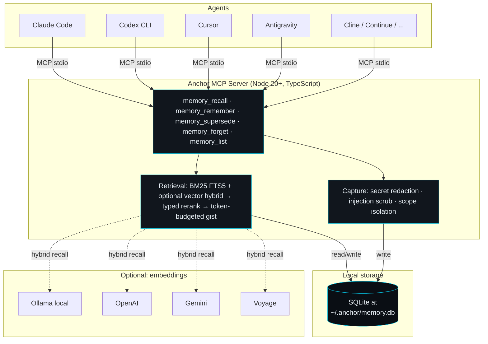

<div align="center">

<h1>Anchor</h1>

<p><strong>Cross-agent memory for AI coding agents. Local-first.</strong></p>

<p>Switch agents — Claude Code, Codex, Cursor, Cline, Antigravity — and your project context comes with you.</p>

<p>
  <a href="https://www.npmjs.com/package/@anchormem/anchor"></a>
  <a href="LICENSE"></a>
  <a href="https://modelcontextprotocol.io"></a>
  <a href="https://skills.sh"></a>
  <a href="CONTRIBUTING.md"></a>
</p>

</div>

---

## The Problem

Developers build deep context with an AI agent—defining project preferences, structural decisions, and mental models—over several hours of work. However, when switching tools due to usage limits, collaboration needs, or specialized features, the new agent starts cold. You are forced to re-explain choices and answer questions that were already settled.

This is not a model limitation, but a **portability problem**: session memory is locked inside each individual AI tool or provider's silo.

## The Solution

Anchor is a local-first Model Context Protocol (MCP) server and an open Agent Skill. It enables any modern AI coding agent to read from and write to a single, durable, project-specific memory. 

When a new agent session starts, it retrieves a highly compressed, token-budgeted gist of what matters—rather than a full, noisy conversation transcript. No external accounts or API keys are required. All data is stored locally in a SQLite file at `~/.anchor/memory.db`.

---

## Visual Architecture

The diagram below shows how Anchor sits between your agents and your local database. Any agent that speaks the Model Context Protocol (MCP) or Vercel Skills specification can automatically read from and write to your shared local memory.



---

## Installation & Setup

Set up Anchor and connect it to your favorite AI coding agents in under a minute.

### 1. Install, Initialize & Auto-Register

Run the following command to install the CLI, initialize your local environment, and **automatically register the MCP server inside all detected local AI coding tools** (Claude Code, Cursor, Codex, Windsurf, Cline, and Antigravity):

```bash
npx @anchormem/anchor init
```

That's it! Running `init` scans your machine, locates configuration folders for your installed agents, and injects the Anchor MCP server entry directly. No manual config editing is required.

### 2. Share with your Team (Optional but Recommended)

To make context sharing seamless for your team, run the `setup` command inside your project's repository root:

```bash
npx @anchormem/anchor setup
```

This generates project-scoped configuration files (like `.mcp.json` for Claude Code, `.cursor/mcp.json` for Cursor, and `.agents/mcp_config.json` for Antigravity). Teammates who clone the repository will have their AI tools auto-detect and load Anchor without any manual setup!

### 3. Verification & Manual Fallbacks

Run the built-in diagnostic suite to confirm everything is configured perfectly:

```bash
npx @anchormem/anchor doctor
```

Should you ever need to perform manual registration, Anchor supports standard MCP configurations. Simply map the server key `anchor` to the command `anchor-server` (or `npx -y @anchormem/anchor@latest anchor-server`) in your tool's settings.

---

## How It Works

### Four-Tier Memory Structure

Anchor stores project context in four distinct, typed structures, preventing unstructured context drift.

| Type | Description | Example |
| :--- | :--- | :--- |
| **Fact** | A durable developer preference or architectural constraint. | *Uses pnpm, not npm* |
| **Decision** | An active choice made during a task, along with its specific rationale. | *Use PostgreSQL for order service due to ACID compliance* |
| **Episode** | A short, 1-3 sentence summary of a task, automatically recorded by the agent. | *Added rate limiting via Redis token bucket; updated src/auth/middleware.ts* |
| **Artifact** | A specific file pointer, symbol, or reference URL. | `src/auth/middleware.ts:42` |

When a fact or decision is updated, the agent uses `memory_supersede` to retire the older record rather than leaving conflicting entries. Older task episodes decay in salience over time, keeping your active context clean.

### Per-Language Prioritization & Boosting

In multi-language repositories (monorepos or polyglot codebases), memories are automatically scoped by language:
1. **Auto-Tagging on Capture**: When an agent saves a fact, decision, or episode, Anchor automatically infers the target programming language (e.g., `typescript`, `go`, `rust`, `python`) by analyzing file paths, extensions, markdown code blocks, or syntax patterns.
2. **Context-Aware Boosting**: When an agent requests context, Anchor detects the active programming language from the agent's current files. Memories matching that language receive a **1.5x rank weight boost** and a **+0.5 base score**.
3. **No Hidden Context**: Cross-language/general memories (like pnpm commands or architectural designs) still surface, but out-of-scope specific languages are gently deprioritized to preserve the limited context token budget.

---

## Performance & Context Optimization

Anchor uses hierarchical structuring and a highly optimized local retrieval engine to keep your agent's context small and relevant. 

Measured offline against pasting full prior transcripts (the realistic alternative for manual context sharing), Anchor achieves a **44x context compression ratio** with **100% recall** of required facts.

### Benchmark Results (8 Scenarios)

The following evaluations are fully reproducible using the local harness (`node tests/eval/run.mjs`). They cover diverse project domains including backend development, SaaS billing, ML pipelines, infrastructure, and mobile apps.

| Scenario | Category | Baseline (Cold) | With Anchor (Warm) | Context Saved | Hit Rate | FTS Precision |
| :--- | :--- | :---: | :---: | :---: | :---: | :---: |
| **Auth rate limiting** | Backend API | 9,400 tokens | 224 tokens | **97.6%** | 100% (5/5) | 80.0% |
| **Stripe billing migration** | SaaS Payments | 7,800 tokens | 163 tokens | **97.9%** | 100% (3/3) | 100.0% |
| **Turborepo monorepo** | Infrastructure | 12,500 tokens | 304 tokens | **97.6%** | 100% (6/6) | 83.3% |
| **ML pipeline debugging** | ML/Data | 15,000 tokens | 334 tokens | **97.8%** | 100% (6/6) | 83.3% |
| **React Native state management** | Mobile | 11,200 tokens | 271 tokens | **97.6%** | 100% (5/5) | 100.0% |
| **EC2 to Kubernetes migration** | DevOps | 13,800 tokens | 330 tokens | **97.6%** | 100% (6/6) | 66.7% |
| **Security audit remediation** | Security | 10,500 tokens | 276 tokens | **97.4%** | 100% (6/6) | 66.7% |
| **MySQL to PostgreSQL database migration** | Database | 18,000 tokens | 337 tokens | **98.1%** | 100% (6/6) | 83.3% |
| **Aggregate Summary** | **All Domains** | **98,200 tokens** | **2,239 tokens** | **97.7%** | **100% (43/43)** | **82.9%** |

*Note: In all scenarios, information leak prevention successfully validated that no superseded or redacted content was retrieved (0 leaks).*

---

## Core Product Features

- **Scope-Isolated Contexts:** Anchor automatically detects directory boundaries based on your working directory, keeping memories isolated to the relevant project.
- **Per-Language Prioritization:** In monorepos or multi-language projects, Anchor automatically tags memories with their active programming language and applies a 1.5x soft-boosting relevance adjustment when working inside those languages, ensuring relevant context fits inside the token budget first.
- **Durable Four-Tier Memory:** Organizes information into distinct, structured types (Facts, Decisions, Task Episodes, and Artifacts) for structured and precise recall.
- **Local SQLite Engine:** Uses local SQLite FTS5 (BM25) for ultra-fast, zero-dependency, and deterministic retrieval.
- **Embedded Security & Redaction:** Automatically scrubs credentials (such as Stripe, Slack, AWS, and OpenAI keys) and prompt-injection keywords at write-time, before they ever hit the disk.
- **Hybrid Semantic Search (Optional):** Integrates seamlessly with Ollama (local), OpenAI, Gemini, or Voyage to provide keyword-independent vector-hybrid retrieval.

---

## Advanced Configuration & Commands

<details>
<summary><b>Semantic Recall via Vector Embeddings</b></summary>

Anchor's default retrieval is BM25 over SQLite FTS5—fast, deterministic, and requiring no external setup. For keyword-independent recall (e.g., retrieving "token verification key rotation" when the query is "auth key renewal"), you can enable semantic vector search.

### Supported Providers

| Provider | Default Model | Best For |
| :--- | :--- | :--- |
| **Ollama** | `nomic-embed-text` | Completely local, free, offline retrieval |
| **OpenAI** | `text-embedding-3-small` | Highly optimized cloud-hosted retrieval |
| **Gemini** | `text-embedding-004` | Google Cloud ecosystems |
| **Voyage** | `voyage-3` | Anthropic-recommended embeddings |

### Setup Examples

#### Ollama (Local)

```bash
ollama pull nomic-embed-text
export ANCHOR_EMBED_PROVIDER=ollama
```

#### OpenAI

```bash
export ANCHOR_EMBED_PROVIDER=openai
export ANCHOR_OPENAI_API_KEY=sk-your-key-here
```

#### Gemini

```bash
export ANCHOR_EMBED_PROVIDER=gemini
export ANCHOR_GEMINI_API_KEY=your-key-here
```

#### Voyage

```bash
export ANCHOR_EMBED_PROVIDER=voyage
export ANCHOR_VOYAGE_API_KEY=your-key-here
```

### Backfilling Embeddings

For existing scopes, backfill vector representations by running:

```bash
anchor reembed
```
</details>

<details>
<summary><b>Auto-load Memory on Session Start (Zero Tool Calls)</b></summary>

You can automatically inject your project's history the moment an agent session starts, without requiring the agent to make manual tool calls. Anchor reads your directory scope, compiles a 1,500-token gist, and inserts it directly.

For **Claude Code**, add the following hook configuration to your `~/.claude/settings.json`:

```json
{
  "hooks": {
    "SessionStart": [{ "command": "anchor hook claude-code session-start" }]
  }
}
```

For other agents, pipe the scope payload directly into the agent's initialization or system prompt argument:

```bash
echo '{"cwd":"'"$PWD"'"}' | anchor hook generic session-start
```

If the current directory contains no stored memories, the hook returns nothing, preserving your token budget.
</details>

<details>
<summary><b>HTTP Transport Mode</b></summary>

By default, Anchor communicates via MCP over standard I/O (stdio). For browser-based agent interfaces, containerized pipelines, or remote development, Anchor can be run in HTTP transport mode:

```bash
# Enable HTTP server via flag
anchor-server --http

# Or via environment variable
ANCHOR_TRANSPORT=http anchor-server

# Custom port configuration (defaults to 3838)
ANCHOR_HTTP_PORT=4000 ANCHOR_TRANSPORT=http anchor-server
```

> [!CAUTION]
> HTTP transport binds exclusively to `127.0.0.1` and enforces strict security headers, CORS restrictions to localhost origins, rate limiting (100 requests/minute), and host-header DNS rebinding protection. Never expose this server directly to public networks.
</details>

<details>
<summary><b>Interactive CLI Console & Command Reference</b></summary>

Anchor includes an interactive console for manual memory management and search. Open it anytime by running:

```bash
anchor
```

Within the interactive shell, type a term to search, or use commands like `/remember`, `/supersede`, or `/forget`.

### CLI Command Reference

| Command | Purpose |
| :--- | :--- |
| `anchor init` | Sets up the `~/.anchor` environment database. |
| `anchor status` | Displays active database location and memory counts. |
| `anchor list` | Lists all memories recorded within the current directory scope. |
| `anchor diff --since 1d` | Displays changes made to the database (supports intervals like `1h`, `7d`, `30d`). |
| `anchor replay` | Provides a chronological breakdown of decisions and episodes. |
| `anchor doctor` | Performs diagnostic health checks on directories, scopes, and configurations. |
| `anchor export > backup.json` | Backs up all memories to a JSON file. |
| `anchor import backup.json` | Restores database states from a JSON backup. |
| `anchor prune` | Automatically archives or drops older, low-salience task episodes. |
```
</details>

---

## Security & Privacy

Anchor is designed for enterprise grade security and private-first operations:
- **Client-Side Redaction:** Scans and redacts standard credential formats (AWS keys, Slack webhooks, OpenAI/Stripe API keys, and JWTs) before saving memories to disk.
- **Prompt Injection Defense:** Filters out common injection payloads (such as "ignore previous instructions") at write-time.
- **Local Isolation:** Database files are kept with strict POSIX permissions (`0600` for database files, `0700` for directories). No telemetry is captured, and no outbound network calls are made.

## Development Status

Phase 0 and Phase 1 are complete. Current work focuses on polishing distribution and platform tooling:
- Durable SQLite schemas, BM25 indexing, and vector-hybrid support are fully implemented.
- Automatic redaction, scope mapping, and local permission hardening are in place.
- Hook frameworks for Claude Code, Antigravity, and other generic CLI interfaces are functional.
- The evaluation harness passes all integration scenarios.

## Contributing

We welcome contributions to extend the Anchor ecosystem. Focus areas include:
- Verification and installation scripts for new development environments.
- Additional regex patterns for secret redaction.
- Optimization contributions to the BM25 reranking engine.

Please refer to [CONTRIBUTING.md](CONTRIBUTING.md) for style guidelines and repository structures.

## License

This project is licensed under the [MIT License](LICENSE).
